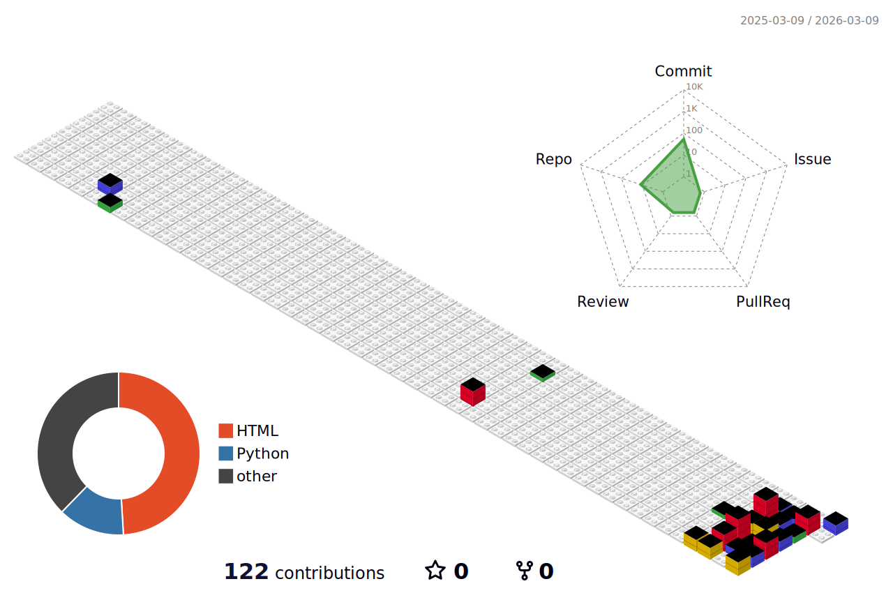

# 👋 _Hi! I'm Disha_

AI & ML Engineer. - 💼 [LinkedIn](https://www.linkedin.com/in/disha-nayak-155a8a211)

---

<!-- 

 -->

<h4>Contributions</h4>

<h4>Profile Visitors</h4>

---

### "Any sufficiently advanced technology is indistinguishable from magic" - Arthur C. Clarke

**⭐ If you find my work interesting, consider starring some repos!**

