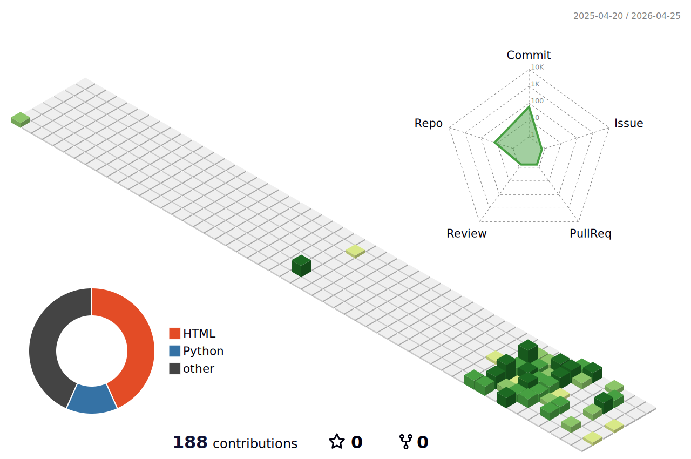

# 👋 _Hey there! I'm Disha Nayak_

🤖 AI & ML Engineer

I build fun stuff

---

### 🛠️ Tech

```python
skillset = {
    'languages': ['Python', 'SQL'],
    'ml_frameworks': ['PyTorch', 'TensorFlow', 'scikit-learn', 'Keras'],
    'data_wizardry': ['pandas', 'numpy', 'matplotlib', 'seaborn', 'plotly'],
    'mlops_tools': ['MLflow', 'Weights & Biases', 'Docker'],
    'cloud_platforms': ['AWS', 'GCP', 'Azure'],
    'databases': ['PostgreSQL', 'MongoDB']
}
```

### 🌍 Location

Currently based in **Bengaluru** - you can usually find me wherever there's:

- Good coffee
- Chess Meetups
- Bookstores

### 📫 Let's Connect

- 💼 [LinkedIn](https://www.linkedin.com/in/disha-nayak-155a8a211)
- 📧 dishanayak027@gmail.com

Response time: Usually within 24 hours

---

## 📈 GitHub Stats & Activity


<div align="center">

## 🌌 3D Contribution Graph



## </div>

## 📊 Profile Visitors


---

<div align="center">

### "Any sufficiently advanced technology is indistinguishable from magic" - Arthur C. Clarke

**⭐ If you find my work interesting, consider starring some repos!**

</div>
